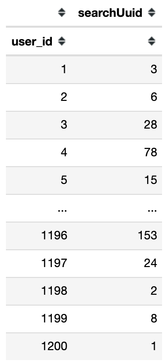
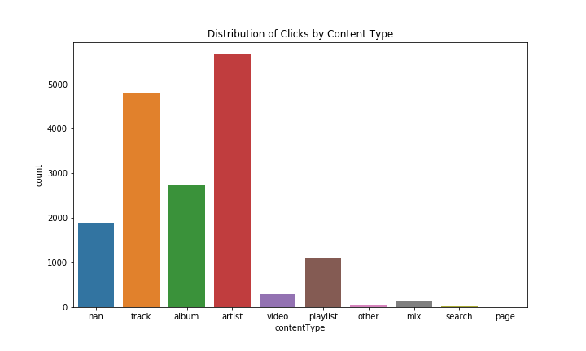
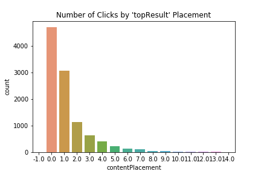
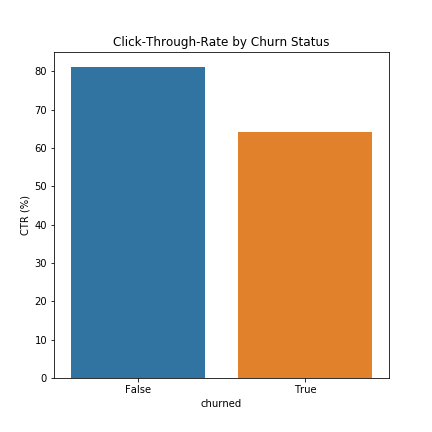
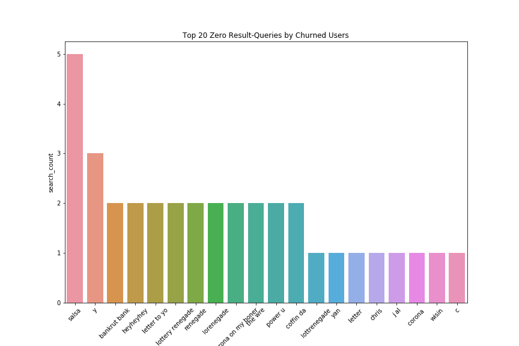
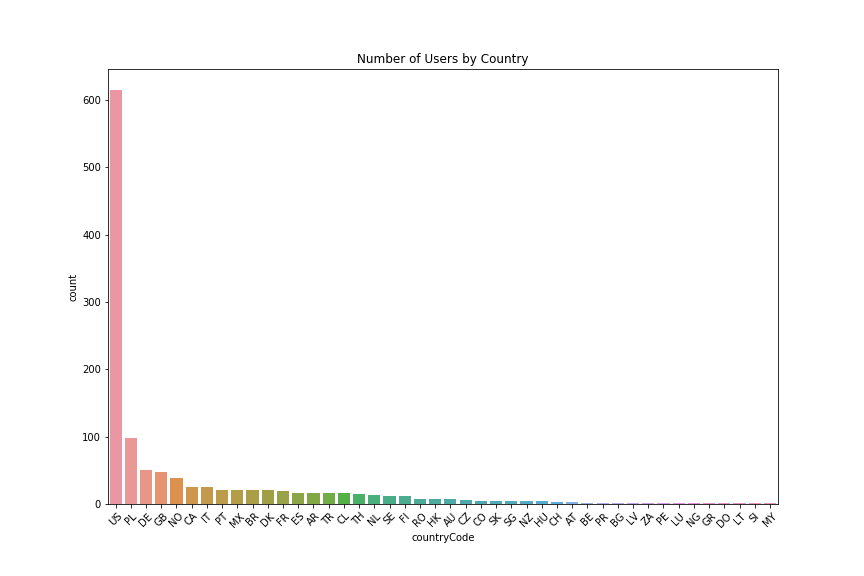
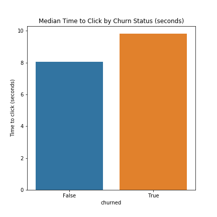
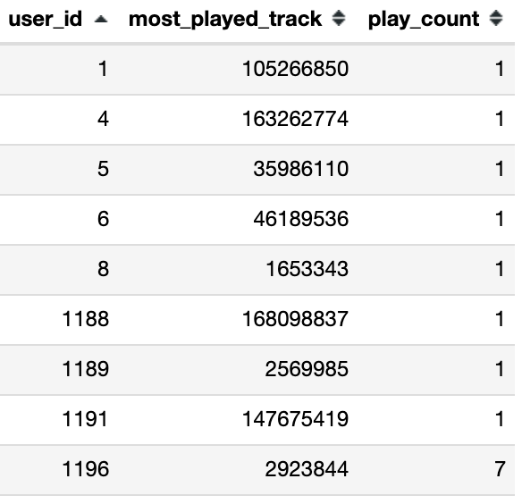
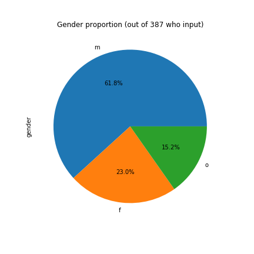
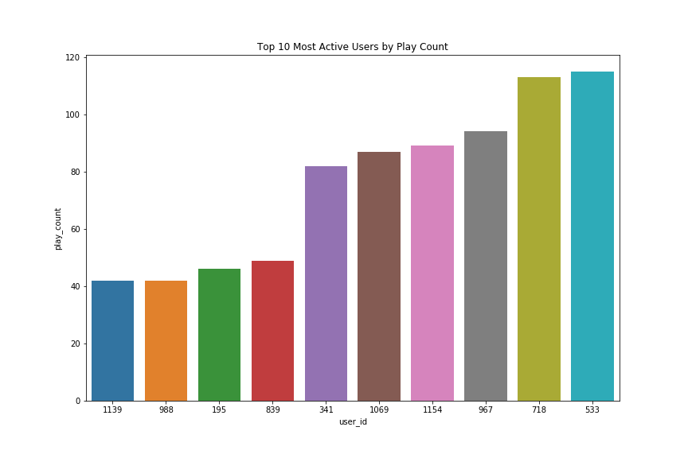

# TIDAL analysis_challenge

#LOADING ANALYSIS PRODUCTION LEVEL..........

Various metrics were calculated, and then enriched with user_metadata.

Some definitions:

**Search session** = *A series of events under a unique search id. Some sessions have numerous queries, as TIDAL search engine populates results continuously as a user is typing. Completion of a session is typically a click on content (i.e. not 'cancelSearch').*

**Click** - *A click on content, either track, artist, video, etc.*

Initial/suggested metrics:

1) **Number of search sessions with a result:** 8064 search sessions

2) **Number of search sessions with a click per user:**

3) **Distribution of Clicks by Content Type:**

4) **Average query length:** 7.20 characters 

5) **CTR (click-through rate) by client platform:** 

*android* - 72.40%

*desktop* - 77.96%

*iOS*     - 86.06%

6) **Number of search clicks on topResults:**

7) **Average/Median time to click per search session:** 7.5965 seconds

8) **Number of search sessions with a query that had zero search results:** 365 search sessions

# User_metadata enrichment/exploration:

1) **User Churn rate:** 3.583 %  (43 users)

2) **Number of search sessions with zero results by churn status:** 

Search sessions with zero results by churned users: 26

Search sessions with zero results by returning users: 339

3) **CTR by churn status:**

4) **Churned user searches with zero results:**

5) **Users by country:**

6) **Median User Age:** 35 Years Old

7) **Median time to click by churn status:** 

8) **Most played track per user:**

9) **Gender preportion of userbase:**

10) **Top 10 Most Active Users by Play Count:**

# Future Analysis Recommendations
• Regarding median time to click: Some events were triggered and ended at the same time... having such good recommendations on the front page is convenient for users. But does tidal want this? Less time to click or spending more time on the app?

• look at activity by user per month or week

• Investigate why some searches turn 0 results

• Look at total activity per user over time

• Find ways to cater to gender equality in users

• Investigate activity by users in less represented countries, add more music from those countries?

• Further investigation into user churning/retention

• Refining data input to avoid errors

# Future Work
In addition to the future analysis recs, I would like to compile all code for each metric into a designated function for reuse. 

